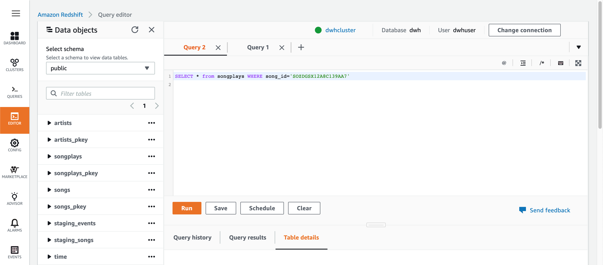
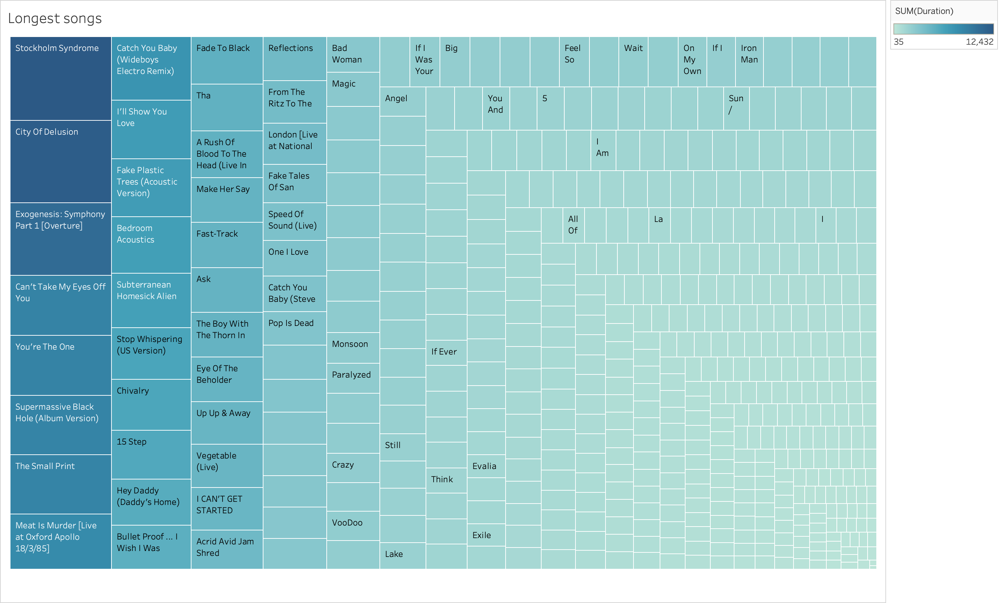
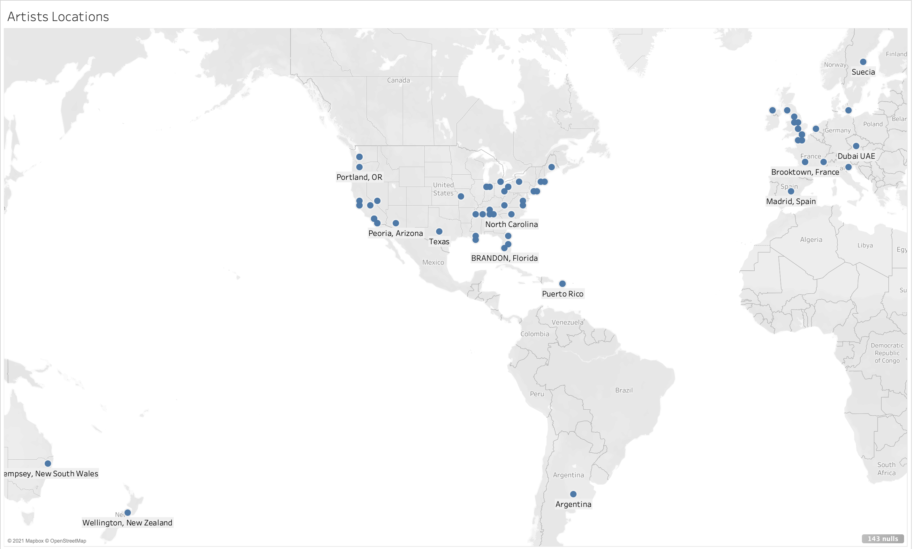
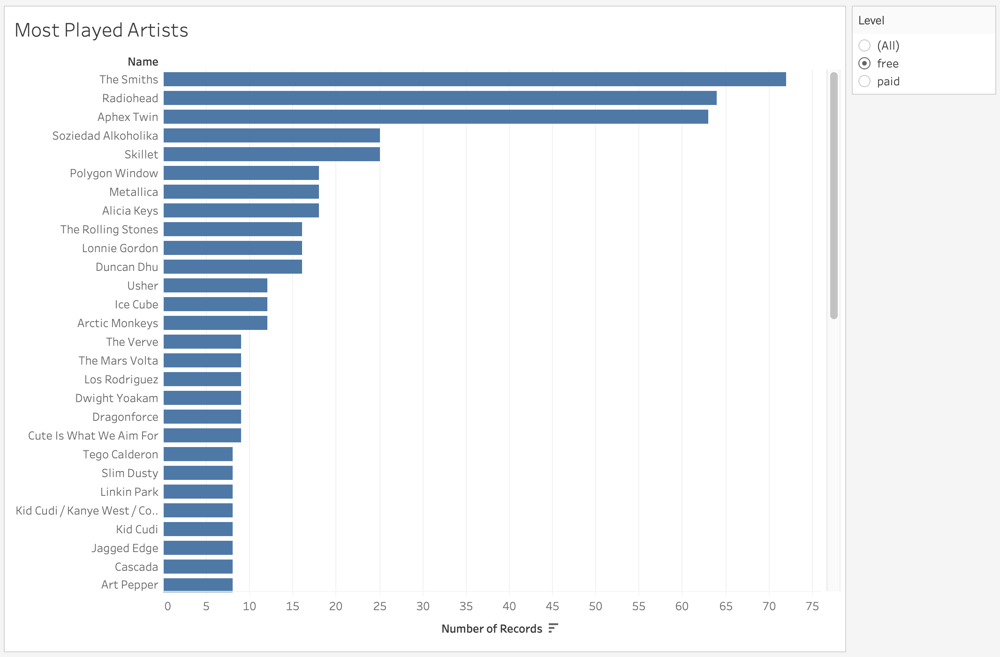
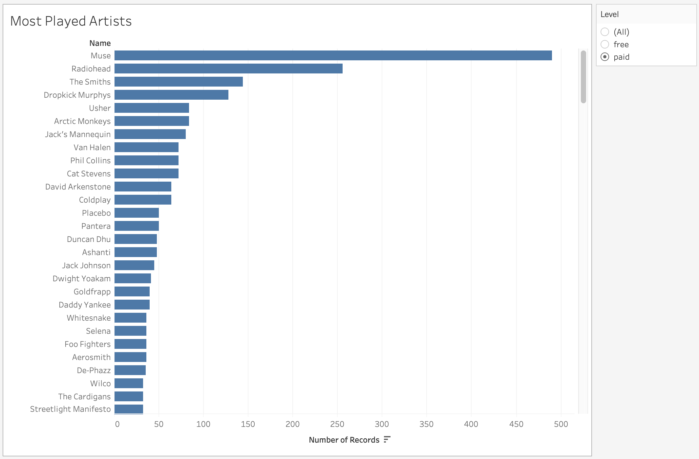
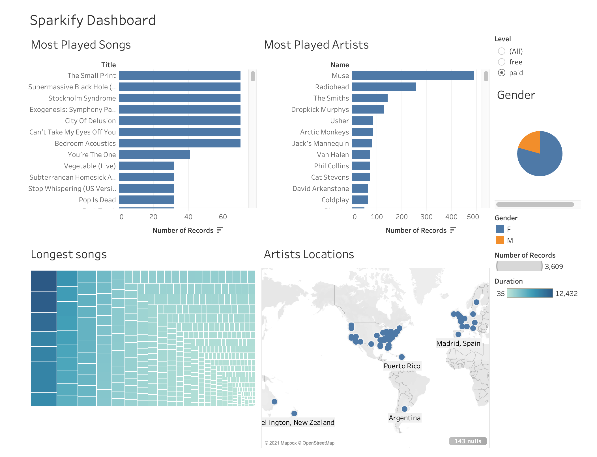

# AWS-DataWarehouse
In this project, we explore how to create and use a **Redshift** data warehouse on AWS. 
Once the data warehouse is up and running, we copy some *Sparkify* data stored in S3, AWS storage environment. *Sparkify* is a pseudo start-up like Spotify and provides us with data on songs and user activities on their web-site.
After transferring and transforming (via an ETL process) this data into a STAR schema (with facts and dimensions), we access those tables from Tableau where we can create a beautiful dashboard and extract insights about our songs, customers and their interactions with our start-up.

# Files
This project includes the following files:
- **dwh.cfg**: a config file which includes the data warehouse settings. This file also includes the AWS key and associated secret which are necessary to create and access AWS resources.
- **sql_queries.py**: a file which includes all the SQL queries used in our project. In this project, we create and delete tables. We also insert data in our tables.
- **create_tables.py**: Python script which uses sql_queries to create our project tables.
- **etl.py**: Extract, Transform and Load (ETL) script which transfers data (from AWS S3) and transforms it into our STAR model data schema.
- **RedshiftClusterSetup.ipynb**: Jupyter Notebook which highlights the various steps in order to create and delete a Redshit datawarehouse on AWS.
- **README.md**: The file you're reading right now.

# Instructions
If you already have access to an AWS Redshift cluster, skip to step 4. Otherwise, follow instructions outlined in Step 1 to 3.

## Step 1 - Create an AWS Admin Account
The first step for this project is to create your AWS Admin Account which allows you to secure a Redshift data warehouse, create users, copy files to S3, etc...
Simply log into AWS and create this user in the IAM console. Once the user is created, you will receive a key-secret pair. This pair shouldn't be stored online because it would allows others to use AWS at your expenses!! Handle with care!

## Step 2 - Update Data Warehouse Config file
Type in your key and secret in the dwh.cfg file. Make sure you don't *push* this file back to git for the reasons explained above.

## Step 3 - Create an AWS Redshift data warehouse
Since you now have an AWS admin account, you can secure some AWS resources such as a redshift data warehouse. We can secure those resources by using the AWS admin console (online) or by using a Python API. We also create an ARN policy which enables Redshift to access S3 storage environment in ReadOnly mode. In our case, we decided to create this AWS Redshift resource with the Python SDK. We included the instructions in the following Jupyter Notebook: **RedshiftClusterSetup.ipynb**

## Step 4 - Update Data Warehouse Config file
Once the Redshift data warehouse is up and running, you can add its end-point (a.k.a address) and ARN policy that we created in the previous step to the **dwh.cfg** file.

## Step 5 - Create Tables
Now, it's time to create some tables in our data warehouse. We can do so by simply running the following Python script: **create_tables.py**.
The script should run without any error.

## Step 6 - ETL process
Assuming that the tables get created properly, we can now initiate our ETL process by **running the ETL.py script**. This script will take about **5 minutes** to complete.

# Check the data in AWS Redshift
Once the scripts are completed as expected, we can verify that the databases were properly populated by using Redshift SQL Query Editor tool.

In the Query Editor, we can verify that the 2 staging tables were created as expected. We also have the 5 tables from our STAR schma.
We also performed a few queries on the table to verify that they were populated with data.

## Access Redshift from Tableau
As a bonus, we can connect to Redshift from Tableau by providing the end-point and user credentials included in the **config.dwb** file.

# Project Details
In this section we provide more details on the project such as the data warehouse architecture, data base schema, lessons learned, Tableau dashboard and insights.

## Data Warehouse Architecture
The Data Warehouse architecture looks as follows:

It is composed of a S3 storage area where our song and log data files are stored. 
The architecture also includes 2 database tables used for staging purpose:
- staging_logs
- staging_songs

The architecture includes 5 other databases organized in a STAR schema. Those other databases can be used and queries by business analysts.

## Lessons learned
We faced a few challenges during this project. In this section, we share the few lessons learned.

### Misalignment during data transfer
Source data in S3 needed to be transfered into staging databases. In order to do so, we need to make sure there is a way to "align" the source data format with the destination table. The number of DB attributes need to match in number and type otherwise the ETL process will fail.

We worked with two datasets that reside in S3. Here are the S3 links for each:

- Song data: s3://udacity-dend/song_data
- Log data: s3://udacity-dend/log_data
Log data json path: s3://udacity-dend/log_json_path.json

When key names matches with column names, you don't need a json path file to parse the data and you can use the 'auto mode' for dealing with json. If key names in json files are different from the columns names of the table to be loaded, or the keys to be parsed are of different depth, a json path file is required to be able to parse the data correctly.

More info here: https://docs.amazonaws.cn/en_us/redshift/latest/dg/t_loading-tables-from-s3.html

Here are the commands that we use to transfer both datasets from S3 into the staging tables:

<PRE><CODE>
  staging_events_copy = ("""copy staging_events from {}
                            credentials 'aws_iam_role={}'
                            region 'us-west-2'
                            json {};""").format(LOG_DATA, DWH_ROLE_ARN, LOG_JSONPATH)

  staging_songs_copy = ("""COPY staging_songs from {}
                          credentials 'aws_iam_role={}'
                          region 'us-west-2'
                          json 'auto';""").format(SONG_DATA, DWH_ROLE_ARN)
</CODE></PRE>

In the first copy command, we copy the log data (path available in LOG_DATA variable) to the staging_events table. We also provide the user role that we created with the data warehouse. This role has read access to S3. We also pass on the LOG_JSONPATH argument to this COPY command so it can match the data as organized on S3 to the data in the staging_events database.

For the transfers to succeed, we also need to ensure that the data types match or get converted as expected.

### Using the Query Editor
The Query Editor ended up being a great tool to test our various upsert queries before adding them to our script.

### On Conflict doesn't exist in Redshift
In Postgres, we can use the On Conflict keyword to handle cases where we have duplicated primary keys for example. On Conflict is not available in Redshift, so we had to come up with an alternative.

<PRE><CODE>
  user_table_insert = ("""INSERT INTO users (user_id, first_name, last_name, gender, level)
                            SELECT DISTINCT userId, firstName, lastName, gender, level
                            FROM staging_events
                            WHERE page = 'NextSong' AND userId NOT IN (SELECT DISTINCT user_id FROM users);""")
</CODE></PRE>

In the situation above, we indicate that we will add records only if they are associated to a unique (not distinct) user_id.

## Accessing Data Warehouse via Tableau
The main purpose of a data warehouse is to prepare data such that business analysts can analyze this data and extract insights from it. To verify that this would be possible, we decided to create a few work sheets in Tableau to visualize the data and combined them into a single dashboard.

### Worksheets & Insights
By analyzing the data in Tableau, we managed to discover a few business insights:

* The 3 longest songs in the song catalog are **The Stockholm Syndrome, City of Delusion and Exogenesis: Symphony Part 1 (overture)**.

* Artists are mostly located in **Great Britain, USA East Coast and California**.

* **Men are cheaper than women**: The gender distribution shows that we have 66% of female customers against 33% male customers in the free model. However, when we switch to the Paid model, it changes to 75% female versus 25% male.

* These were the most popular artists in Nov 2018 (data time frame): **Muse, Radio Head, The Smiths** and **Usher** across all levels. Below some charts that show how the popularity varies between paid and free models.

* These were the most popular songs during the same time frame: **The Small Print, Super Massive Blackhole** and **Stockholm Syndrome**, all by Muse.

All those sheets can be combined in a Sparkify dashboard as follows.

# Conclusion
Overall, this is was a fun project. We managed to create a data warehouse which serves as the center piece of an ETL process. Business Analysts can access the data warehouse from BI applications like Tableau and extract insights on how our business is doing.
